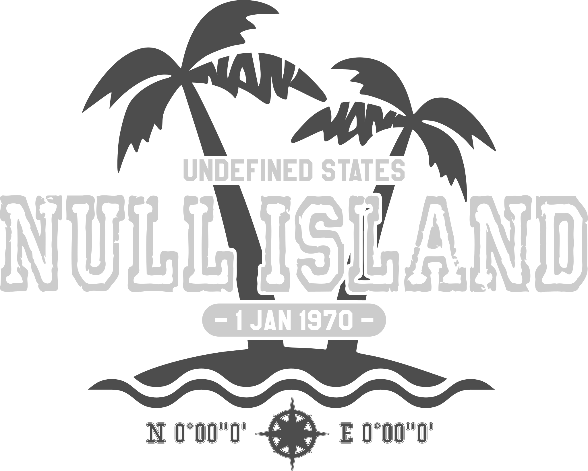

# Null Island

A design reflection about the representation of missing values.

* [Null Island (SVG)](./null-island.svg)

## Get a shirt

I strongly encourage you to print this shirt yourself or at a local printshop you trust.

However, if you want me to shut up and take your money, [here is a shop](https://yetzt.myspreadshop.de/).

## Donations

If you want to express appreciation for this design, consider a donation to the [OpenStreetMap Foundation](https://donate.openstreetmap.org/) or [FOSSGIS e.V.](https://www.fossgis.de/verein/spenden/)

## License

&copy; NaN undefined, [CC0 1.0 Universal](./LICENSE.md)
